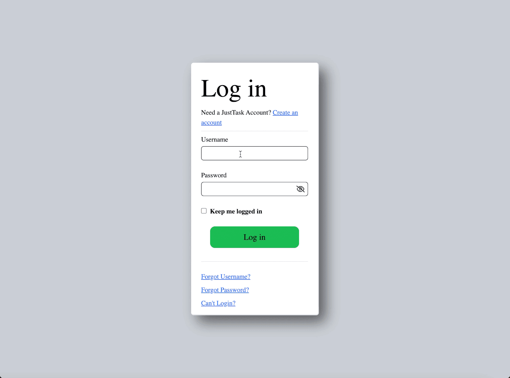

# JustTracks 🗂️
[](https://github.com/Jr3582/track-tasks/actions/workflows/ci.yml)



A full-stack project management web application inspired by Jira and Trello. Built as a portfolio project to demonstrate full-stack development skills including REST API design, authentication, and relational database modeling.

---

## About

JustTracks allows users to create projects, manage tasks, and collaborate with team members. Users can register, log in, create and manage projects, invite members, assign tasks, and track progress — all within a clean, responsive UI.

---

## Tech Stack

### Backend
- **.NET 10** / **ASP.NET Core Web API**
- **Entity Framework Core** (ORM)
- **PostgreSQL** (Database)
- **BCrypt.Net** (Password hashing)
- **JWT Bearer Authentication**

### Frontend
- **Vanilla JavaScript**
- **Tailwind CSS** (CDN)
- **Font Awesome** (Icons)
- **SortableJS** (Drag and drop)
- **Playfair Display** (Google Fonts)

### DevOps & Testing
- **Docker** (Multi-stage builds) + **docker-compose**
- **xUnit** (Unit testing with EF Core InMemory)
- **GitHub Actions** (CI pipeline)

---

## Features

- **Authentication** — Register and login with JWT-based auth. Passwords are hashed with BCrypt. All protected routes require a valid token.
- **Project Management** — Create, rename, and delete projects. Projects are scoped to the logged-in user.
- **Member Management** — Add and remove members from projects. Only project members can invite others. Owners are automatically added as members on project creation.
- **Task Management** — Create, update, delete, and drag-and-drop tasks between status columns (To Do, In Progress, Done).
- **Task Assignment** — Assign tasks to specific project members.
- **Unique Username Validation** — Real-time username availability check on registration.
- **Inline Editing** — Rename projects directly in the UI without a separate form.
- **Kebab Dropdown Menu** — Per-project context menu with portal pattern to escape overflow clipping in scrollable containers.
- **Automated Testing** — xUnit test suite covering endpoint behavior and authorization edge cases (404/409/403/201) using an in-memory EF Core database.
- **Continuous Integration** — GitHub Actions workflow runs the full test suite on every push.
- **Containerized Deployment** — One-command setup with Docker Compose (API + PostgreSQL).

---

## Getting Started

### Option 1: Run with Docker (recommended)

The fastest way to get JustTracks running — no local .NET or PostgreSQL setup required.

**Prerequisites:** [Docker Desktop](https://www.docker.com/products/docker-desktop)

```bash
git clone git@github.com:Jr352/track-tasks.git
cd track-tasks
docker-compose up --build
```

Then apply the database migrations (one-time setup, with containers running):
```bash
dotnet ef database update --connection "Host=localhost;Database=tracktasks;Username=jimmyren;Password=postgres;Port=5432"
```

The API will be available at `http://localhost:5056` (Swagger at `/swagger`).

### Option 2: Run locally

**Prerequisites:**
- [.NET 10 SDK](https://dotnet.microsoft.com/download)
- [PostgreSQL](https://www.postgresql.org/download/) (v14+)
- A modern web browser

### 1. Clone the repository
```bash
git clone git@github.com:YOUR_USERNAME/JustTracks.git
cd JustTracks
```

### 2. Set up the database
Create a PostgreSQL database:
```sql
CREATE DATABASE justtracks;
```

### 3. Configure the connection string
In `appsettings.json`, update the connection string:
```json
"ConnectionStrings": {
  "DefaultConnection": "Host=localhost;Database=justtracks;Username=YOUR_PG_USER;Password=YOUR_PG_PASSWORD"
}
```

### 4. Apply migrations
```bash
dotnet ef database update
```

### 5. Run the backend
```bash
dotnet run
```
The API will start at `http://localhost:5056`. You can explore all endpoints via Swagger at `http://localhost:5056/swagger`.

### 6. Open the frontend
Open `index.html` in your browser directly, or use a live server extension (e.g. VS Code Live Server).

---

## Running Tests

The test suite uses xUnit with an in-memory EF Core database — no real database required.

```bash
dotnet test
```

Tests cover endpoint behavior including authorization gates (user/project existence, duplicate membership conflicts, caller permission checks). The same suite runs automatically on every push via GitHub Actions.

---

## Project Structure

```
JustTracks/
├── .github/
│   └── workflows/
│       └── ci.yml              # GitHub Actions CI pipeline
├── Controllers/
│   ├── ProjectsController.cs   # Project + member endpoints
│   ├── TasksController.cs      # Task CRUD endpoints
│   └── UsersController.cs      # Auth + user endpoints
├── Models/
│   ├── Project.cs
│   ├── TaskItem.cs
│   ├── User.cs
│   └── UsersToProjects.cs      # Many-to-many junction table
├── Data/
│   └── AppDbContext.cs
├── Migrations/
├── track-tasks.Tests/          # xUnit test project
│   └── ProjectsControllerTests.cs
├── frontend/
│   ├── index.html
│   ├── login.html
│   ├── register.html
│   ├── js/
│   │   ├── app.js
│   │   ├── api.js
│   │   ├── ui.js
│   │   └── popups.js
│   └── css/
├── Dockerfile                  # Multi-stage build (SDK → runtime)
├── docker-compose.yml          # API + PostgreSQL orchestration
└── appsettings.json
```

---

## API Overview

| Method | Endpoint | Description |
|--------|----------|-------------|
| POST | `/Users/register` | Register a new user |
| POST | `/Users/login` | Login and receive JWT |
| GET | `/Users/check?username=` | Check username availability |
| GET | `/Projects` | Get all projects for current user |
| POST | `/Projects` | Create a new project |
| PUT | `/Projects/{id}` | Rename a project |
| DELETE | `/Projects/{id}` | Delete a project |
| GET | `/Projects/{id}/members` | Get members of a project |
| POST | `/Projects/{id}/members` | Add a member to a project |
| DELETE | `/Projects/{id}/members/{userId}` | Remove a member from a project |
| GET | `/Tasks` | Get all tasks for current project |
| POST | `/Tasks` | Create a new task |
| PUT | `/Tasks/{id}` | Update a task |
| DELETE | `/Tasks/{id}` | Delete a task |

---

## Author

**Jimmy** — Drexel University, BS Computer Science  
[GitHub](https://github.com/Jr3582) · [LinkedIn](https://www.linkedin.com/in/jimmy-ren-dev/)